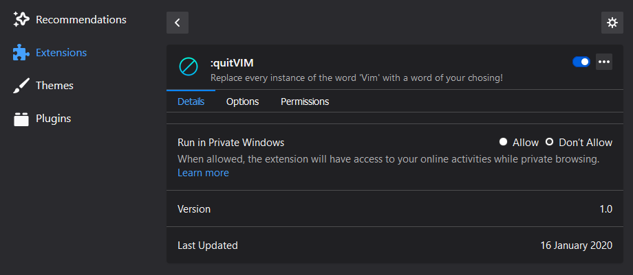

# :quitVim
###### Firefox word replacer for Vim

[Vim](https://www.vim.org/) is a super powerful text editor which you should definitely [learn to use](https://www.openvim.com/).

It does however, have a bit of a reputation as a running joke in online dev communities, and gets mentioned a lot either as a running joke, or by people who use Vim trying to defend its usefulness.

I got sick of seeing it mentioned so much, so I created this custom Firefox extension to replace all instances of the word 'Vim', with whatever word I fancy seeing more of that particular day.

## Icon Credit:
Made by [kiranshastry](https://www.flaticon.com/authors/kiranshastry), provided by [Flaticon](https://www.flaticon.com/).